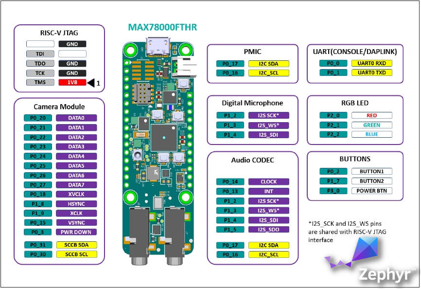

# ZEPHYR RTOS ON MAX78000FTHR

This project is an experimental port of ZEPHYR RTOS [zephyr] to MAX78000's [max78k] MAX78000FTHR AI Development Kit [max78kfthr] that consists of ARM Cortex-M4F (100MHz) and RISC-V (60MHz) co-processor with Hardware Neural Networks capability as part of the Elektor Magazine [elektor] and Maxim AI Design Contest. Porting Zephyr, my favourite RTOS, opens up whole world of possibilities for this kind of AI MCUs and Boards. Development is done on FreeBSD Unix [freebsd] therefore full Open-Source compatibility is guranteed. Due Zephyr requirements Apache 2.0 license applies.

## MAX78000FTHR

* MAX78000 Microcontroller
  * Dual Core: Arm Cortex-M4 Processor with FPU, 100MHz, RISC-V Coprocessor, 60MHz
  * 512KB Flash Memory
  * 128KB SRAM
  * 16KB Cache
  * Convolutional Neural Network Accelerator
  * 12-Bit Parallel Camera Interface
  * MAX20303 Wearable PMIC with Fuel Gauge
  * Charge from USB
  * On-Board DAPLink Debug and Programming
  * Interface for Arm Cortex-M4 processor with FPU
  * Breadboard Compatible Headers
  * Micro USB Connector
  * Micro SD Card Connector

* Integrated Peripherals
  * RGB Indicator LED
  * User Pushbutton
  * CMOS VGA Image Sensor
  * Low-Power Stereo Audio CODEC
  * Digital Microphone
  * SWD Debugger
  * Virtual UART Console
  * 10-Pin Cortex Debug Header for RISC-V Coprocessor

## TODO

* [ ] Find a way to use pyOCD  to flash the MCU/Board.
* [ ] Create Zephyr External Application code (using west [west] workspace on this repo).
* [ ] Create Zephyr SOC configuration for MAX78000 using DTS.
* [ ] Create Zephyr Board configuration for MAX78000FTHR DevKit using DTS.
* [ ] Create Zephyr Blinky example.
* [ ] Build, Flash, Verify Zephyr Blinky on MAX78000FTHR DevKit.

## References

* [zephyr] https://zephyrproject.org
* [max78k] https://www.maximintegrated.com/en/products/microcontrollers/MAX78000.html
* [max78kfthr] https://www.maximintegrated.com/en/products/microcontrollers/MAX78000FTHR.html
* [elektor] https://www.elektormagazine.com/news/maxim-integrated
* [freebsd] https://www.freebsd.org/
* [pyocd] https://github.com/pyocd/pyOCD
* [west] https://docs.zephyrproject.org/latest/guides/west/index.html

---

(C) 2021 CeDeROM Tomasz CEDRO, https://www.tomek.cedro.info.
