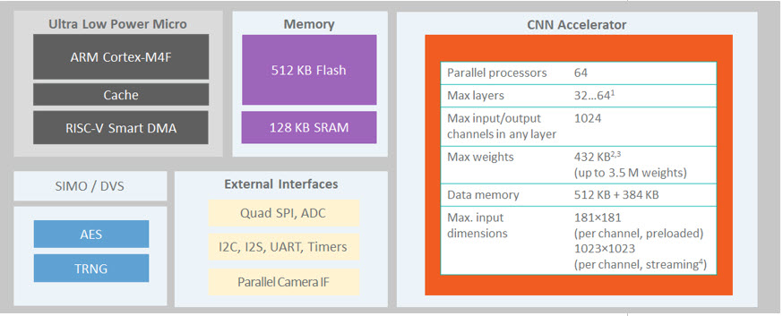

# ZEPHYR RTOS ON MAX78000FTHR

<p align="center" width="100%"></p>

This project is an experimental Open-Source platform independent port of ZEPHYR RTOS [zephyr] to MAX78000's [max78k] MAX78000FTHR AI Development Kit [max78kfthr] that consists of ARM Cortex-M4F (100MHz) and RISC-V (60MHz) co-processor with Hardware Neural Networks capability as part of the Elektor Magazine [elektor] and Maxim AI Design Contest. Porting Zephyr, my favourite RTOS, opens up whole world of possibilities for this kind of AI MCUs and Boards. Development is done on FreeBSD Unix [freebsd] therefore full Open-Source compatibility is verified, no vendor specific parts shall be used (i.e. Windows-only Maxim's Micros SDK). Due Zephyr requirements Apache 2.0 license applies (may shift to MIT if Elektor insists).

The MAX78000 is a new generation of AI microcontrollers built to enable the execution of neural networks at ultra-low power and live at the edge of the IoT. This product combines the most energy-efficient AI processing with Maxim Integrated's proven ultra-low power microcontrollers. The hardware-based CNN accelerator enables battery-powered applications to execute AI inferences while spending only microjoules of energy. The MAX78000 features an Atarm® Cortex®-M4 with FPU microcontroller for efficient system control with an ultra-low power deep neural network accelerator. A RISC-V core is also integrated and can execute application and control codes as well as drive the CNN accelerator. Please take a look at [local project documents](doc/) and product page [max78k] and its application notes site [max_appnote7417].

<p align="center" width="100%"></p>


## MAX78000FTHR

* MAX78000 Microcontroller
  * Dual Core: Arm Cortex-M4 Processor with FPU, 100MHz, RISC-V Coprocessor, 60MHz
  * 512KB Flash Memory
  * 128KB SRAM
  * 16KB Cache
  * Convolutional Neural Network Accelerator
  * 12-Bit Parallel Camera Interface
  * MAX20303 Wearable PMIC with Fuel Gauge
  * Charge from USB
  * On-Board DAPLink Debug and Programming
  * Interface for Arm Cortex-M4 processor with FPU
  * Breadboard Compatible Headers
  * Micro USB Connector
  * Micro SD Card Connector

* Integrated Peripherals
  * RGB Indicator LED
  * User Pushbutton
  * CMOS VGA Image Sensor
  * Low-Power Stereo Audio CODEC
  * Digital Microphone
  * SWD Debugger
  * Virtual UART Console
  * 10-Pin Cortex Debug Header for RISC-V Coprocessor


## TODO

* [ ] Find a way to use pyOCD  to flash the MCU/Board.
  * MAX78000FTHR seems to have onboard DAPLink probe [daplink] with ARM Cortex-M4F Target attached.
  * pyOCD does not recognise Board ID - may indicate problems with flashing.
  * CMSIS Pack Manager does not contain MAX78000 MCU.
* [ ] Create Zephyr External Application code (using west [west] workspace on this repo).
* [ ] Create Zephyr SOC configuration for MAX78000 using DTS.
* [ ] Create Zephyr Board configuration for MAX78000FTHR DevKit using DTS.
* [ ] Create Zephyr Blinky example.
* [ ] Build, Flash, Verify Zephyr Blinky on MAX78000FTHR DevKit.


## WORKBENCH

### Flash and Debug

MAX78000FTHR has onboard DAPLink debug probe [daplink] attached to ARM Cortex-M4F MCU. 

pyOCD connects to `DAPLink CMSIS-DAP`:

```
(venv37zephyr) pyocd list
  #   Probe                   Unique ID
--------------------------------------------------------------------------------
  0   ARM DAPLink CMSIS-DAP   04440001f7cdc1c400000000000000000000000097969906
```

pyOCD can Debug Target ARM MCU. However Board ID is unknown that means Debug may be available but Flashing may not work:

```
(venv37zephyr) pyocd gdb
0000722:WARNING:mbed_board:Board ID 0444 is not recognized, using generic cortex_m target.
0000722:WARNING:board:Generic 'cortex_m' target type is selected by default; is this intentional? You will be able to debug most devices, but not program  flash. To set the target type use the '--target' argument or 'target_override' option. Use 'pyocd list --targets' to see available targets types.
0000723:INFO:board:Target type is cortex_m
0000782:WARNING:pyusb_backend:USB Kernel Driver Detach Failed ([None] b'Unknown error'). Attached driver may interfere with pyOCD operations.
0000842:INFO:dap:DP IDR = 0x2ba01477 (v1 rev2)
0000861:INFO:ap:AHB-AP#0 IDR = 0x24770011 (AHB-AP var1 rev2)
0000889:INFO:rom_table:AHB-AP#0 Class 0x1 ROM table #0 @ 0xe00ff000 (designer=14b part=127)
0000899:INFO:rom_table:[0]<e000e000:SCS-M4 class=14 designer=43b part=00c>
0000906:INFO:rom_table:[1]<e0001000:DWT class=14 designer=43b part=002>
0000913:INFO:rom_table:[2]<e0002000:FPB class=14 designer=43b part=003>
0000917:INFO:cortex_m:CPU core #0 is Cortex-M4 r0p1
0000929:INFO:cortex_m:FPU present: FPv4-SP-D16-M
0000936:INFO:dwt:4 hardware watchpoints
0000941:INFO:fpb:6 hardware breakpoints, 4 literal comparators
```

pyOCD does not seem to have support for MAX78000 yet even with CMSIS Pack Manager [cpm]:

```
(venv37zephyr) pyocd pack update
...
(venv37zephyr) pyocd pack find max
  Part              Vendor   Pack          Version   Installed
----------------------------------------------------------------
  MAX32620          Maxim    MAX32620      1.0.2     False
  MAX32621          Maxim    MAX32620      1.0.2     False
  MAX32625          Maxim    MAX32625      1.1.0-a   False
  MAX32626          Maxim    MAX32625      1.1.0-a   False
  MAX32630          Maxim    MAX32630      0.2.7-b   False
  MAX32631          Maxim    MAX32630      0.2.7-b   False
  MAX32650          Maxim    MAX32650      1.1.0-a   False
  MAX32651          Maxim    MAX32650      1.1.0-a   False
  MAX32652          Maxim    MAX32650      1.1.0-a   False
  MAX32660          Maxim    MAX32660      1.2.0     False
  MAX32665          Maxim    MAX32665      0.6.2     False
  MAX32666          Maxim    MAX32665      0.6.2     False
  MAX71616          Keil     ZEUS_DFP      1.0.0     False
  MAX71617          Keil     ZEUS_DFP      1.0.0     False
  MAX71636          Keil     ZEUS_DFP      1.0.0     False
  MAX71637          Keil     ZEUS_DFP      1.0.0     False
  S32K142MAxxxLHx   Keil     S32_SDK_DFP   1.3.0     False
  S32K142MAxxxLLx   Keil     S32_SDK_DFP   1.3.0     False
  S32K144MAxxxLHx   Keil     S32_SDK_DFP   1.3.0     False
  S32K144MAxxxLLx   Keil     S32_SDK_DFP   1.3.0     False
  S32K144MAxxxMHx   Keil     S32_SDK_DFP   1.3.0     False
  S32K146MAxxxLHx   Keil     S32_SDK_DFP   1.3.0     False
  S32K146MAxxxLLx   Keil     S32_SDK_DFP   1.3.0     False
  S32K146MAxxxLQx   Keil     S32_SDK_DFP   1.3.0     False
  S32K146MAxxxMHx   Keil     S32_SDK_DFP   1.3.0     False
```


## References

* [zephyr] https://zephyrproject.org
* [max78k] https://www.maximintegrated.com/en/products/microcontrollers/MAX78000.html
* [max78kfthr] https://www.maximintegrated.com/en/products/microcontrollers/MAX78000FTHR.html
* [elektor] https://www.elektormagazine.com/news/maxim-integrated
* [freebsd] https://www.freebsd.org/
* [pyocd] https://github.com/pyocd/pyOCD
* [west] https://docs.zephyrproject.org/latest/guides/west/index.html
* [daplink] https://github.com/ARMmbed/DAPLink
* [cpm] https://github.com/pyocd/cmsis-pack-manager
* [max_appnote7417] https://www.maximintegrated.com/en/design/technical-documents/app-notes/7/7417.html


---

<sub>(C) 2021 CeDeROM Tomasz CEDRO, https://www.tomek.cedro.info.</sub>
